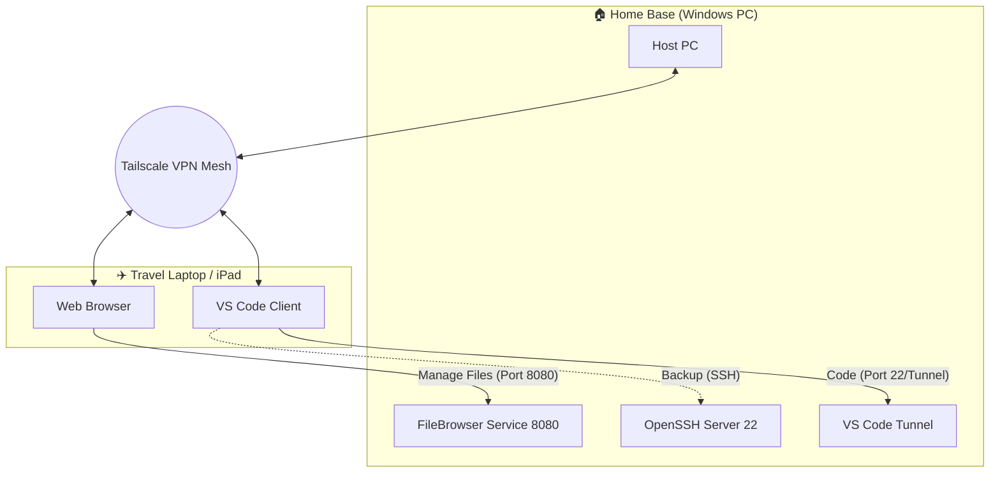

# Remote-Dev-Setup with Private NAS by kimzam
**Remote Programming** With Visual Studio Code (VSC) with **Private Windows NAS**
 
 ## Architecture
 - Host Machine (Main machine that runs the code) : Windows Desktop (Always ON)
 - Network : Tailscale Mesh VPN (Direct P2P Connection)
 - Code Access : VS Code Remote Tunnels 
 - Backup Access : OpenSSH Server (Windows Native)
 - File Access : FileBrowser (Self-hosted web GUI)

 ## Configuration Steps 
 ### 1. Network & Security
 - Install Tailscale 
 - **FIX** (optional): Disabled SMB Multichannel to prevent throttling.
 ```Set-SmbServerConfiguration -Enable Multichannel $false -Force```
- **Firewall** : Whitelisted Tailscale subnet (100.0.x) for SMB traffic.

### 2. SSH Backup (Just In Case Layer)
- Enabled Windows OpenSSH Server via Optional Features on Windows Setting .
- **Service** : Set 'sshd' to Automatic startup .
- **Trap Avoided** : Created a local user ```nas_user``` to bypass Microsoft Account authentication issues over SSH

### 3. Web NAS (FileBrowser)
- Tool : [FileBrowser] (https://filebrowser.org)
- **Persistence** : Used NSSM (Non-Sucking Service Manager) to run the binary as a background Windows service
- **Command** : ```.\filebrowser.exe -r "D:\Files" -a 0.0.0.0 -p 8080```

## How to Connect
- **Coding** : 'Code tunnel' via VS Code Desktop.
- **Terminal** : ```ssh nas_user@tailscale-ip```
- **Files** :```http://< tailscale-ip >:8080```


## 🗺️ Network Architecture


# Notes
- Tailscale MagicDNS makes remembering IPs unnecessary
- I have included the ```setup_firewall.ps1``` script in the ```/scripts``` folder to automate the network configuration on new machines .

# Hardware Specs

- **Host Machine**: KIM_MAIN
- **CPU**: Ryzen 5 5500G
- **RAM**: 64GB DDR4 (Crucial for Running VS Code Server + NAS)
- **Storage**: 512GB For OS , 4TB For NAS Storage

- **Client Machine**: Dell XPS 15 / Samsung Tab S9 FE
- **OS**: Windows 11 / Android


## Future RoadMap
- [ ] Set up **Wake-On-Lan**(WOL) to turn on the PC on remotely.
- [ ] add **Docker** to the Host PC for running containers.
- [ ] Create a backup script to mirror the NAS to Google Drive